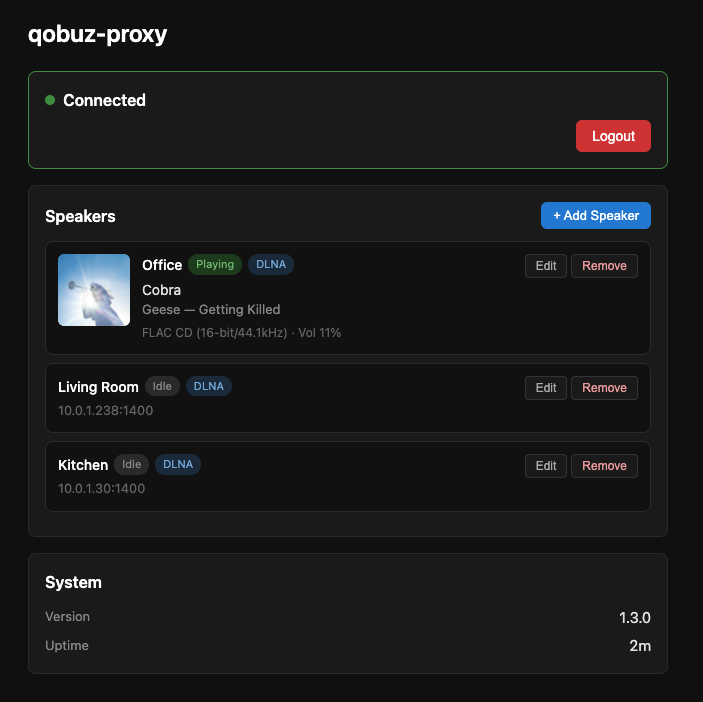

# QobuzProxy

A bridge between Qobuz Connect and DLNA speakers. Also supports local audio playback.

## Why?

Qobuz has a "Connect" feature (similar to Spotify Connect) that lets you control playback on supported devices from their app. Unfortunately, many popular speakers — most notably **Sonos** — don't support Qobuz Connect natively. This means you can't pick a Sonos speaker as a playback target in the Qobuz app, even though Sonos fully supports DLNA/UPnP streaming.

QobuzProxy solves this by acting as a virtual Qobuz Connect device on your network. When you open the Qobuz app, QobuzProxy shows up as a selectable speaker. When you play music, it receives the stream from Qobuz and forwards it to your DLNA-compatible speaker (like Sonos), preserving hi-res audio quality.

**In short:** Run QobuzProxy on a Raspberry Pi (or Docker or any always-on machine) on your local network, and your Sonos speakers become fully controllable Qobuz Connect targets — play, pause, skip, and adjust volume, all from the official Qobuz app.

<p align="center">
  
</p>

## Features

- Appears as a Qobuz Connect device in the official Qobuz app
- Streams audio to DLNA renderers (Sonos, Denon HEOS, etc.)
- Local audio playback via PortAudio (play directly through your machine's speakers/DAC)
- **Web UI for speaker management** — discover, add, edit, and remove speakers from your browser
- Auto-detects device capabilities to select optimal audio quality
- Zero-config startup — boot with no config file, set everything up from the web UI
- Runs on Raspberry Pi, Docker, or any Linux/macOS system

## Audio Quality

By default (`max_quality: auto`), QobuzProxy queries your DLNA device's capabilities and automatically selects the best supported quality. You can also set a specific quality level:

| Value | Format |
|-------|--------|
| `auto` | Auto-detect from device (recommended) |
| `5` | MP3 320 kbps |
| `6` | FLAC CD (16-bit/44.1kHz) |
| `7` | FLAC Hi-Res (24-bit/96kHz) |
| `27` | FLAC Hi-Res (24-bit/192kHz) |

## Local Audio Playback

QobuzProxy can also play audio directly through your machine's speakers or DAC, without needing a DLNA device. Set the `QOBUZPROXY_BACKEND` environment variable to `local`:

```bash
docker run -d --network host \
  -v ./data:/data \
  -e QOBUZPROXY_BACKEND=local \
  --device /dev/snd \
  ghcr.io/leolobato/qobuz-proxy:latest
```

Note: The `--device /dev/snd` flag gives the container access to the host's audio devices (Linux only). Qobuz credentials should be in your `data/config.yaml`.

## Installation

A pre-built Docker image is available from GitHub Container Registry:

```bash
docker pull ghcr.io/leolobato/qobuz-proxy:latest
```

### Quick Start (Docker)

```bash
docker run -d --network host \
  -v ./data:/data \
  ghcr.io/leolobato/qobuz-proxy:latest
```

Then open **http://localhost:8689** in your browser, log in to Qobuz, and add your speakers from the web UI. No config file needed.

The `/data` volume persists auth tokens, credentials, and speaker configuration across restarts.

You can also pre-configure speakers with a `config.yaml` or environment variables — see [Configuration](#configuration) below.

View logs:
```bash
docker-compose logs -f
```

### Quick Start (without Docker)

```bash
pip install .
qobuz-proxy
```

Open **http://localhost:8689**, authenticate, and add speakers from the UI. Speaker configuration is saved to `config.yaml` in the current directory automatically.

To use a pre-existing config file: `qobuz-proxy --config /path/to/config.yaml`

### Authentication

QobuzProxy authenticates via Qobuz's OAuth flow — just click a button and log in:

1. Start QobuzProxy (Docker or standalone).
2. Open **http://localhost:8689** in your browser.
3. Click **Log in to Qobuz** — you'll be redirected to the Qobuz sign-in page.
4. Log in with your Qobuz credentials.
5. You'll be redirected back to QobuzProxy, now authenticated.

The auth token is cached locally. You only need to do this once until the token expires. This works the same whether running locally, in Docker, or behind a reverse proxy.

**Power-user alternative:** You can skip the web UI by providing `auth_token` and `user_id` directly in your `config.yaml`:

```yaml
qobuz:
  user_id: "12345678"
  auth_token: "your-auth-token"
```

Or via environment variables: `QOBUZ_USER_ID` and `QOBUZ_AUTH_TOKEN`.

### Multi-Speaker Setup

A single QobuzProxy instance can manage multiple speakers. Each speaker appears as a separate device in the Qobuz app.

The easiest way to set up multiple speakers is through the web UI at **http://localhost:8689** — click **+ Add Speaker** for each device. The web UI will scan your network for DLNA devices and let you configure each one. Changes are saved to `config.yaml` automatically.

You can also configure speakers directly in `config.yaml`:

```yaml
speakers:
  - name: "Living Room"
    backend: dlna
    dlna_ip: "192.168.1.50"
    max_quality: auto

  - name: "Office"
    backend: dlna
    dlna_ip: "192.168.1.51"
    max_quality: 7

  - name: "Headphones"
    backend: local
    audio_device: "Built-in Output"
```

Ports are auto-assigned unless explicitly set via `http_port` and `proxy_port`. See `config.yaml.example` for all available options.

### Network Requirements

**Important**: QobuzProxy requires `network_mode: host` (Docker) or direct host access for mDNS discovery to work. This allows the Qobuz app to find the device on your local network.

If you cannot use host networking, consider:
- Using a macvlan network with a dedicated IP on your LAN
- Running QobuzProxy directly on the host (not in Docker)

### Configuration

The config file is found automatically in this order:

1. `--config` CLI argument (if provided)
2. `./config.yaml` (current directory)
3. `$QOBUZPROXY_DATA_DIR/config.yaml` (set to `/data` in the Docker image)

Environment variables and CLI arguments override config file values. See `.env.example` for available environment variables.

### Data Directory

In Docker, both the config file and credential cache live under `/data`:

```yaml
volumes:
  - ./data:/data
```

This directory stores auth tokens and the Qobuz web player credential cache so they persist across restarts. Outside Docker, the cache defaults to `~/.qobuz-proxy/`.

### Health Check

The container includes a health check that verifies the HTTP server is responding:
```bash
docker inspect --format='{{.State.Health.Status}}' qobuz-proxy
```

## Acknowledgments

This project is based on the Qobuz Connect reverse-engineering work done by [Tobias Guyer](https://github.com/tobiasguyer) in [StreamCore32](https://github.com/tobiasguyer/StreamCore32). Thanks to his efforts in figuring out the Qobuz Connect protocol, this project was possible.

## Disclaimer

This project was built almost entirely through agentic programming using [Claude Code](https://claude.ai/claude-code). The architecture, implementation, and tests were generated through AI-assisted development with human guidance and review.

## License

[MIT](LICENSE)
